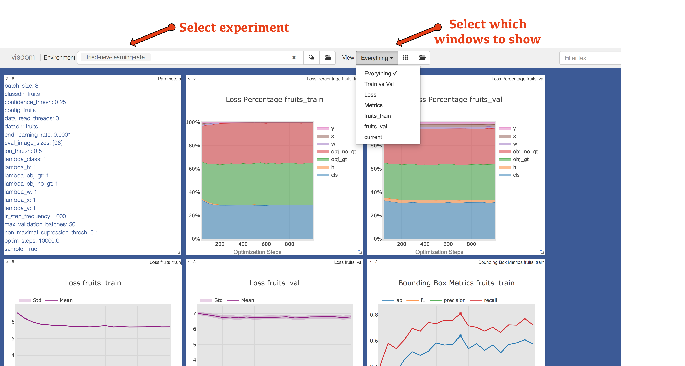
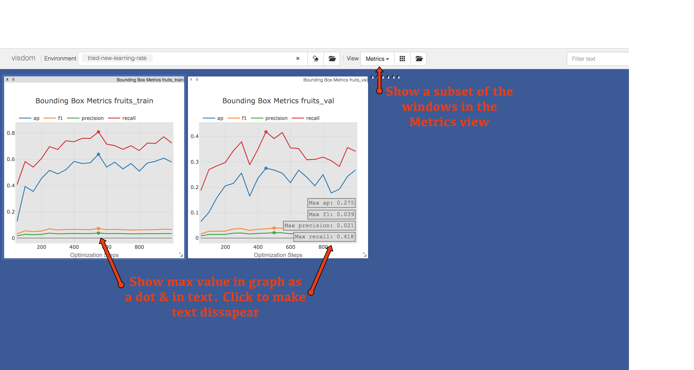

# Introduction
This repo focuses on **readability and ease of use**. It doesn't match the original YOLO code by 100% but rather aims to help users **train on their own dataset.**

The project has been developed on Ubuntu 16.04 and also tested on Mac Sierra. Works on Python 3.5 & Pytorch version 1.1.
Contributions are welcome :) Just make sure that your code is 2-space indented & neat.

The project is currently not under devolopment but feel free to reach out through the issues / email if you'd like me to help implement a specific feature.

### Supports
* Training & validation on custom datasets
* Easy to use input parameters 
* Visualize data through plots in Visdom
* Metrics - PascalVOC AP, F1, precision, recall, loss
* Inference - List of images
* More... ;)




# Installation
* Install Pytorch, instructions on their [website](https://pytorch.org/). GPU version is strongly recommended but not required. Just slow without GPU.
* pip install -r requirements.txt
* If you want to use the visualisation code you'll need to install visdom>0.1.8.8 due to a bug that was fixed [here](https://github.com/facebookresearch/visdom/pull/561). Visdom is not stable but you can install the latest version with `pip install git+https://github.com/facebookresearch/visdom`

# Demo - Custom Datasets 
We've prepared two datasets that you can train on to check the program out. The **Faces** dataset consists of one class whereas the **Fruits** dataset has several. We suggest that you **download the weights** from the original YOLO website, trained on the COCO dataset, to perform transfer learning (quicker).

## Download COCO Weights
Go to the saved/weights directory and run the `prepare_weights.py`
This will download the official YOLOv3 416px weights and convert them to our format.

## Faces Dataset
1. Go to the datasets/faces directory and run the `prepare_faces.py`
2. Go to data/indexes directory to setup the image index that points to the images in a dataset.
3. Run `python create_image_index.py -d faces -m train` 
4. Run `python create_image_index.py -d faces -m val` 
5. Go back to the project root and run `python train.py --config=faces`

You should see printouts in your console on how the training progress. You should see an AP of \~XX% after YY steps. (TODO: seed the program) 

## Fruits Dataset
In this demo we explain how to change the code to work for new datasets (such as your own) and how you can take advtantage of the config class to change parameters.

### Prepare Data
Download the already prepared data from google drive from [Google Drive](https://drive.google.com/open?id=1XCndSDkB98WSZMjMQzdfk8ZgpP7mjF-g) and put it in datasets/fruits directory.

OR download the data from [Kaggle](https://www.kaggle.com/mbkinaci/fruit-images-for-object-detection) and run the `prepare_fruits.py` in the datasets/fruits directory.

After this, create your image indexes as we did in the faces dataset.
1. Go to data/indexes so that we can create the file list of images needed.
2. Run `python create_image_index.py -d fruits -m train` 
3. Run `python create_image_index.py -d fruits -m val` 

### Add New Config Class
1. Create the following config class in the config/base_config.py file. This class helps you specify input parameters such as which data to train on. Make sure to inherit from the DefaultConfig class.

```python
class Fruits(DefaultConfig):
  def __init__(self, config_str):
    super().__init__(config_str)
    self.validations = ['fruits_train', 'fruits_val']
    self.optim_steps = 200
    self.validation_frequency = 20
    self.skip_last = True
    self.weight_freeze = 'dn53'
    self.train_image_sizes = [416]

    self.use_gpu = False
    self.batch_size = 4
    self.data_read_threads = 0
```

2. Add fruits to the available configs in the train.py file. 
```python
configs = ['coco', 'faces', 'fruits']
```
3. Connect your new config option to the new config class by adding an elif statement in the config/config_util.py file.
```python
elif config_str == 'fruits':
  config_obj = Fruits(config_str)
```

### Run Program
Run python `train.py --config=fruits` to start training with the fruits config, which uses the fruits dataset.

It's also possible to overwrite an input parameter that exist in the DefaultConfig class through input flags such as `train.py --config=fruits --batch_size=4`
The order of precendance is input flag > config class > default config. This was done so that you can set your parameters in the config class, but still overwrite them if you want to do e.g. hyper-parameter search via a bash script.

Just a tip :) I like to have a predict config class, and a debug config class.

# Implemented Features
To get a sense of what's possible out of the box, feel free to look at the DefaultConfig class in config/base_config.py. This file specifies changeable parameters which can clue you in on what features that are implemented.

* This project allows you to train on one dataset, whilst validating on several datasets. This allows you to train on a pedestrian dataset and validate on a pedestrian dataset AND a people-on-bikes dataset.
* Evaluate metrics during runtime. Namely PascalVOC AP, Precision, Recall, F1, Loss
* Save several weights, e.g. saving both the best weights for F1 score as well as loss.
* Manage, visualise and compare different experiments
* Freeze weights
* Weight losses differently
* "Merge" or mix datasets

# Training Visualization Progress
During the evaluation stage of the training, metrics such as loss, AP etc are saved to a file. This information can later be used to visualize the training progress. Either write your own code or utilize the scripts we've prepared in the visualize directory. We use Visdom, a tensorboard variant from Facebook that is capable of plotting many types of plots from matplotlib or plotly. The scripts we've created are a bit hackish, and might not be straight forward to work with. Works fine on my computer  ;)

Feel free to modify the logger.py file to visualize training in other ways, e.g. by using tensorboard(X) (which should now be included in Pytorch).


# Known Issues / Desired Improvements
Do you want to see an improvement that is not in this list? Add it to this link and we'll try to make it happen. TODO

* Include a k-means script that calculates anchor boxes on a dataset.
* Script that can convert labels to our format or handle different formats in the program
* Data augmentation. Preferably so one can create their own augmentation pipelines. Have the normal YOLO as default.
* Inference on Webcam & Video file